# wfm-schedule-optimizer

[](https://github.com/jibrankazi/wfm-schedule-optimizer/actions/workflows/ci-cd.yml)


A contact centre workforce scheduler and intraday operations service. Erlang C sizes non-abandoning queues, Erlang A sizes finite-patience queues against service-level, abandonment and occupancy targets, and mixed-integer programs assign named agents to eligible shifts. All supplied demand and rosters are synthetic.


### Two models live in this repository

They solve the same problem on different grids, and every figure below is
labelled with which one produced it.

| | Weekday model | Continuous 24/7 model |
| --- | --- | --- |
| Grid | 49 intervals x 5 days = **245** | 96 intervals x 7 days = **672** |
| Hours | 07:00-19:15, weekdays | round the clock, all week |
| Roster | 60 agents | 65 agents |
| Binaries | 8,850 | 22,680 |
| Entry point | `run_pipeline.py` | `run_247.py` |
| Charts | `assets/coverage_*.png`, `profile_comparison`, `shift_gantt` | `assets/247_*.png` |
| Extra constraints | - | presence floor, 10h turnaround rest, night rotation |

The weekday model is the simpler case and is documented first. The 24/7 model
is where the presence floor, inter-day rest coupling and night rotation appear,
and it is the one the solver-formulation work was done against.


**Weekday model, one day.** Red is what queueing theory says the interval needs.
Blue is what the optimiser scheduled. Pink is where it fell short.

## Result

| | |
| --- | --- |
| Problem size | 60 agents, 5 days, 49 intervals/day, 37 shift templates, **8,850 binary variables** |
| Demand | 6,287 agent-intervals required across the week, peak 55 concurrent agents |
| Solve | **51 seconds**, CBC, stopped at a 3% relative gap |
| Coverage | **95.5%** of intervals fully staffed (234 of 245) |
| Shortfall | 50 agent-intervals, **12.5 hours** across a 1,572-hour week |
| Constraints | 0 breaches of contracted maximums, leave, or accommodations |

Of those 50 understaffed agent-intervals, **40 are inherent to the demand curve** and only 10 come from individual availability. That split is computed, not estimated — see below.

## v0.3 continuous 24/7 planning case

The original five-day benchmark remains reproducible. The v0.3 model adds a
separate cyclic week because a 22:00 shift cannot be represented by a
day-local mask without losing its after-midnight coverage.

```console
$ python run_247.py
{
  "agents": 65,
  "intervals": 672,
  "shift_options": 840,
  "binary_assignment_variables": 22680,
  "total_model_variables": 24138,
  "constraints": 2937,
  "required_agent_intervals": 8460,
  "presence_floor_constraint_intervals": 672,
  "floor_binding_intervals": 163,
  "peak_required_agents": 34
}
```

The synthetic case uses a peak of 70 contacts per interval, 49 full-time and
16 part-time agents, hourly starts from 22:00 through 06:00, and half-hourly
starts during the day. A four-person floor applies to all 672 intervals and is
represented by an integer slack penalised at 1,000 per missing agent-interval,
versus 100 for ordinary demand shortfall. This keeps the model feasible while
making any safety-floor breach separately measurable. Sunday-night coverage
wraps into Monday.

The assignment model enforces a configurable 10-hour inter-shift rest rule,
no more than three consecutive night starts, and a hard maximum of three
weekly night starts for full-time agents. The weekly night minimum and
contracted-hour minimum are penalised soft bounds; maximum hours remain hard.
`conflicting_option_pairs()` exposes the exact forbidden pairs. CBC uses an
algebraically equivalent bounded daily rest inequality; emitting every pair
produced 268,902 constraints in measurement, while the compact formulation
produces 2,937 total constraints.

`python run_247.py` builds and reports the model. Add `--solve` to run CBC.
A time-limited integer incumbent is labelled `Feasible` and returned only after
independent invariant validation. Missing, fractional, or infeasible results
are rejected rather than published.

### Measured CBC baseline

This result was produced by `python run_247.py --solve --time-limit 185
--gap 0.03` with seed 42. CBC reached the time limit; optimality is not claimed.

| Metric | Measured result |
| --- | ---: |
| Termination | Feasible incumbent; 185-second limit |
| End-to-end solve time | 192.35 seconds |
| Objective / lower bound | 29,900 / 14,124.036 |
| Incumbent-relative gap | 52.762% |
| Fully staffed intervals | 530 / 672 (78.87%) |
| Aggregate demand fulfilment | 96.69% |
| Demand shortfall | 280 agent-intervals |
| Presence-floor breaches | 1 interval / 1 agent-interval |
| Contracted-minimum shortfall | 0 hours |
| Weekly-night-minimum shortfall | 18 shifts across 18 agents |

The requested 3% MIP gap was not reached. `artifacts/cbc_baseline_247.json`
records the run configuration, bound, and exact metric definitions;
`artifacts/coverage_report_247.csv` contains the 672 interval-level results.

### CBC and CP-SAT have different objectives

The CBC path uses one-sided coverage inequalities and omits the overstaffing
penalty. The CP-SAT path retains coverage equalities and priced surplus.
Both are tested, but their objective values cannot establish a solver ranking.
The former comparison runner and discrete-event replay are outside this build.

For the CBC pattern solver, surplus staffing is measured after solving. It has
no wage or surplus term in its objective. A zero gap proves optimality for the
configured shortfall penalties; it does not prove minimum paid hours or cost.

## The two problems

**Sizing** is a queueing question. Given calls arriving and how long each takes, how many agents must be on the phone to answer 80% within 20 seconds without running the floor past 85% occupancy? Erlang C answers it per interval.

**Assignment** is combinatorial. Which named people work which shifts, when everyone has their own contracted hours, booked leave and start-time constraints? That is the MILP.

## Sizing: Erlang C

Offered load in Erlangs is `calls × AHT / 900`. The textbook Erlang C formula is written with factorials:

```
P(wait) = [A^N/N! · N/(N−A)] / [Σ(A^k/k!, k<N) + A^N/N! · N/(N−A)]
```

Evaluated literally in floating point that raises `OverflowError` above roughly 135 Erlangs, because `A^N` overflows a float long before the ratio does. This uses the Erlang B recursion instead, which never forms that term:

```
B(0, A) = 1
B(n, A) = A·B(n−1, A) / (n + A·B(n−1, A))
C(N, A) = B / (1 − ρ(1 − B))          ρ = A/N
```

Identical to machine precision at loads where both work, O(N), no ceiling. A test asserts the equivalence and a second asserts the factorial form overflows where the recursion does not.

**Two criteria, and which one bites depends on scale.** At 25 Erlangs the 80/20 service level forces headcount up while occupancy sits at 83%, comfortably under the cap. At 53 Erlangs the queue enjoys economies of scale — it hits 80/20 while still running agents at 89% — and the occupancy cap becomes the binding constraint. Drop the cap and you get staffing that satisfies the SLA and burns the floor out.

## Service profiles: one engine, four contracts

The mathematics does not know what sector it is running in. What differs
between operations is a small set of parameters, so those are configuration
rather than code:

```python
RAPID_RESPONSE = ServiceProfile(
    name="Rapid response intake",
    target_sl=0.95, target_time_sec=10.0,   # answer 95% within 10 seconds
    max_occupancy=0.70,                     # and do not run the floor past 70%
    min_presence_floor=4,                   # never fewer than four present
    abandons=False,                         # callers hold and redial rather than hang up
)
```

Hand all four the same week of demand and the same handle times:

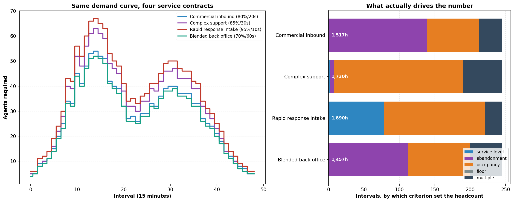

*Weekday model (245 intervals).*

| Contract | Target | Occupancy cap | Agent-hours | vs commercial |
| --- | --- | --- | --- | --- |
| Blended back office | 70% / 60s | 0.88 | 1,456.8 | 0.96 |
| Commercial inbound | 80% / 20s | 0.85 | 1,517.2 | 1.00 |
| Complex support | 85% / 30s | 0.75 | 1,730.2 | 1.14 |
| Rapid response intake | 95% / 10s | 0.70 | 1,890.5 | **1.25** |

Two findings worth more than the headline number.

**Finite patience is now part of sizing, not profile metadata.** Under the
commercial contract, abandonment alone sets 139 intervals, occupancy sets 74,
and 32 need more than one criterion simultaneously. Under complex support the
lower occupancy ceiling dominates 182 intervals. The comparison reports
service level, abandonment, occupancy, floor and multi-binding counts rather
than forcing every interval into an Erlang C category.

**Queues get cheaper per unit of work as they grow.** At 3.6 Erlangs every
contract needs about 1.69 agents per Erlang. At 85 Erlangs commercial falls to
1.18 while rapid response holds at 1.43. Consolidating small queues saves more
than tuning any of them.

**`abandons` is not a measure of urgency.** For an abandoning profile,
`required_agents_erlang_a()` searches the minimum integer count meeting all
three queue targets. Service level is computed with a tagged-caller CTMC and
counts an abandonment as failure; it does not reuse the Erlang C waiting-time
tail. Non-abandoning profiles continue to use Erlang C.

**Duty codes are configuration.** `DutyCodes` carries the taxonomy - what
counts as on-queue, what may be pre-empted, what is relief or absence - and
the rebalancer and API both accept a caller-supplied set. The shipped defaults
are generic English words, not any organisation's scheme.


## Assignment: the legacy weekday MILP

```
x[i,d,s] ∈ {0,1}    agent i works template s on day d
under[d,t] ≥ 0      agents short of the requirement
over[d,t]  ≥ 0      agents surplus to it
short[i]   ≥ 0      hours below agent i's contracted minimum

minimise   100·Σ under  +  1·Σ over  +  50·Σ short·4

s.t.  Σ_s x[i,d,s] ≤ 1                                    one shift per day
      Σ_d,s x[i,d,s]·hours[s] ≤ max_hours[i]              hard ceiling
      Σ_d,s x[i,d,s]·hours[s] + short[i] ≥ min_hours[i]   soft floor
      Σ_i,s x[i,d,s]·cover[s][t] + under − over = req[d,t]
```

Understaffing is the thing being avoided, so it is priced a hundred times a surplus agent. Breaching a contracted minimum sits between the two.

**Shifts come from templates, not free interval booleans.** Unconstrained per-interval variables produce mathematically optimal, operationally absurd rosters where an agent works 07:00–07:15 and again at 16:45. Each template carries a legal shape: contiguous hours, a 30-minute unpaid meal break, two paid 15-minute rests.

**Paid hours and coverage are different numbers.** Rest breaks are paid but off-phone; the meal is neither. An 8-hour template is 34 intervals on site, 32 paid, 30 on the phone. Conflating the two is the classic way to build a roster that looks compliant and still leaves the queue unmanned at 12:30.

**Availability is structural, not a constraint.** A variable only exists where the agent could legally work that template, so leave and accommodations shrink the model instead of adding rows to it.

**The weekly minimum is soft; the maximum is hard.** A hard minimum combined with leave and accommodations makes the model infeasible for reasons that have nothing to do with scheduling, and an infeasible solve tells you nothing. Priced at 50 it still dominates surplus staffing, so the solver only breaches a minimum when nothing else works — and then it reports who and by how much.

## What the optimiser is actually worth

An optimiser is only interesting against something. `src/benchmark.py` is a
greedy scheduler - the approach a competent person builds in a spreadsheet -
run on identical demand, roster and templates, returning the identical
`Schedule` object so every metric is computed the same way.

It is deliberately a strong baseline, not a strawman. It scores shifts by
deficit closed per paid hour, honours every hard constraint the MILP does
(availability, booked leave, start-time accommodations, part-time
eligibility, one shift per day, weekly ceiling), and makes a second pass to
bring agents up to contracted minimums. What it cannot do is reconsider:
every placement is final.

```console
$ python -m src.benchmark

       scheduler  solve_seconds  shifts  scheduled_hours  understaffed  overstaffed  coverage
Greedy heuristic           0.15     295           1816.0           234          752     80.0%
      MILP (CBC)          45.93     293           1924.0            50          952     95.5%
```

**The MILP cuts understaffing by 78.6%** - 234 agent-intervals down to 50,
coverage compliance from 80.0% to 95.5%.

It does not do this for free, and the number that matters is the exchange
rate. The MILP schedules 108 more paid hours (6% more labour) and carries
more surplus, not less. That is the objective function behaving exactly as
written: understaffing is priced a hundred times a surplus agent, so the
solver spends labour to buy coverage whenever it can. An operation that
prices those differently would get a different schedule from the same model,
which is the argument for having the weights in one place and visible.

The heuristic answers in 0.15 seconds against 46. If a schedule is needed
inside a second, the greedy is the right tool and the 15 points of coverage
is what that speed costs.


## Splitting the shortfall

The same coverage problem solved with agents treated as interchangeable — decide only *how many* of each template run each day, no identities, no leave — is a relaxation that solves in 0.6 seconds and bounds what any real schedule can achieve.

```
lower bound (agents interchangeable) : 40 agent-intervals short
solved schedule (named agents)       : 50 agent-intervals short
```

So 40 is a demand-curve problem needing different shift shapes or more establishment, and 10 is a roster problem that different leave approvals would move. Without the bound you cannot tell those apart, and you end up hiring to fix something a scheduling change would have solved.

## Quickstart

```bash
git clone https://github.com/jibrankazi/wfm-schedule-optimizer.git
cd wfm-schedule-optimizer
pip install -r requirements-dev.txt

python run_pipeline.py        # solve the week, write charts and CSVs
python run_247.py             # build and report the continuous 24/7 case
python run_247.py --solve     # run CBC; validate an optimal or feasible incumbent
python run_247.py --solve --demo  # quick solve without replacing stored results
python run_pattern.py weekday_extended --gap 0
python export_schedules.py    # solve all patterns and export CSV/XLSX/grids
pytest -q                     # unit and integration tests
```

CBC ships inside PuLP, so there is no solver to install separately. The full solve takes about a minute; `--step 4` trades roughly nine points of coverage for a six-second solve.

```
--seed        int    reproducibility seed              (default 42)
--time-limit  int    solver time limit in seconds      (default 120)
--gap         float  relative MIP gap to stop at       (default 0.03)
--step        int    shift start granularity           (default 2 = 30 min)
```


## API

```bash
uvicorn api.main:app --host 0.0.0.0 --port 8000
```

Open `http://localhost:8000/docs` for the REST contract. The API exposes vector Erlang C sizing, Erlang A metrics, interval rebalancing, audit-chain verification, and shift-swap checks. Set `AUDIT_VAULT_PATH` to persist the audit JSONL file. The Streamlit and container entry points are outside this build.

## What each agent does

Aggregate coverage can look right while the per-agent plan is unworkable. The staggered starts the optimiser chose show up as a diagonal.


*Weekday model (245 intervals).*

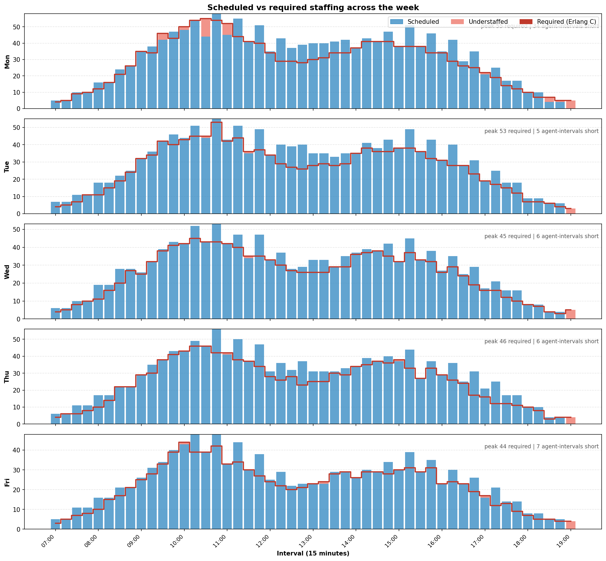

*Weekday model, all five days stacked with peak requirement and shortfall
annotated per day.*

## How it fits together

```
run_pipeline.py
├── generator.py — seeded synthetic demand, roster and shift templates
│   ├── bimodal intraday curve, Monday heavy and Friday light
│   ├── 45 full-time and 15 part-time agents, ~10% with start-window accommodations
│   └── capacity_report() — does contracted labour cover demand at all?
├── erlang.py — interval sizing
│   └── Erlang B recursion, service level and occupancy criteria
├── continuous.py — cyclic 7×96 grid, 65-agent roster and cross-midnight shifts
├── optimizer.py — the MILP
│   ├── solve_schedule() — named agents, all constraints
│   └── coverage_lower_bound() — the relaxation, for splitting the shortfall
├── optimizer_247.py — penalised floor, inter-day rest and night rotation MILP
├── optimizer_cpsat.py — CP-SAT variant with priced overstaffing
├── patterns.py — opening windows, demand and roster configuration
├── schedule_views.py — calendar-day grids and workbooks with overnight carryover
├── erlang_advanced.py — Erlang A inversion and tagged-caller service level
├── smart_rebalancer.py — priority-based offline-duty pre-emption
├── audit_vault.py — append-only, SHA-256 chained audit records
├── api/main.py — FastAPI queueing, rebalancing and audit endpoints
├── reporting.py — coverage chart, week view, agent Gantt
└── tests/ — queueing, audit, API, rebalancing and solver validation
```

Constraints are verified by re-deriving them from the returned assignments rather than trusting the solver: no double bookings, no contracted maximum breached, nobody scheduled during their own booked leave, no part-timer given a full-time shift, and the reported coverage array reconstructed from scratch.

## Operating patterns replace the sector engine

Earlier versions carried a second solver path (`optimizer_universal.py`) that
took an operating window and a policy object as inputs, driven by
`run_sector.py`. Both are gone. The current CBC formulation removes the
surplus columns and their objective cost. The small-instance comparison in
`tests/test_formulation_ablation.py` checks a recorded example; similar bounds
on that example do not prove equivalence of the two objectives.

Operating windows are now expressed in `src/patterns.py` as configuration:
days, opening hours, presence floor, roster and demand peak. See
[Three operating patterns, one engine](#three-operating-patterns-one-engine).

Rest and hours limits are **operational rules**, not statutory ones. The model
enforces a 10-hour turnaround between consecutive shifts and a weekly hours
ceiling because an operation chooses to. No claim is made that these satisfy
any employment statute, and none has been verified against one.

## Scope and roadmap

`docs/SCOPE_AND_ROADMAP.md` records the retained scope and the removed or
unimplemented capabilities: multi-channel sizing, simulation, forecasting,
cost modelling, and skill routing.

## What this does not do

- **Shrinkage is explicit, not an uplift.** Breaks are carved out of the coverage vectors rather than added as a blanket percentage. Unplanned absence and adherence are not modelled, so real coverage would run below what is shown.
- **Demand is deterministic.** Each interval takes its expected volume. A real forecast carries error, and a schedule optimised against a point estimate is fragile to it.
- **The legacy five-day generator defaults to Erlang C.** Profile analysis and the 24/7 generator use Erlang A for finite-patience profiles; multi-class routing is not modelled.
- **Analytical sizing remains interval-stationary.** Erlang C/A headcount sizing does not carry calls between buckets. This build has no stochastic replay.
- **All three operating patterns prove optimality** (0.0% gap), on synthetic
  data, with CBC. This is one seeded run per pattern; the figures are
  reproducible with `python run_pattern.py <pattern>` and are guarded in CI by
  `scripts/check_baseline.py`.
- **Solve quality is run-specific.** A gap-limited or time-limited incumbent is reported as feasible with its measured bound. The legacy 65-agent baseline retains a 52.762% gap.
- **All data is synthetic and seeded.** No real call volumes, no real employees, no real contact centre.
- **Rest limits are operational inputs.** The pattern solver applies its configured turnaround, night caps and contract-hour bounds. The retained sector policy/compiler helpers are not wired into that solver and provide no statutory compliance guarantee.
- **Swap checks are limited.** They check contract kind, one start per day, the shared weekly cap and cyclic seven-day turnaround. Agent availability, skills and night caps need separate validation before a trade is applied.
- **The audit vault is tamper-evident, not immutable infrastructure.** A hash chain detects modified records but cannot prevent a privileged actor from deleting the tail or rewriting the file and all subsequent hashes. External hash anchoring, access controls, retention policy, and independent legal review are still required; this repository does not certify MFIPPA or PIPEDA compliance.

## License

MIT

## What the data and the schedule look like (24/7 model)

Eleven charts of the **continuous 672-interval model**, all rendered from the artifacts a solve already published, so
the pictures always describe the run that is checked in. Regenerate with
`python run_charts.py`.

### The demand being staffed

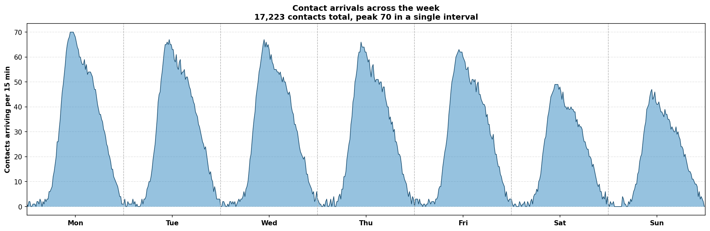

Raw arrivals for the full 672 intervals, before any queueing maths. Two daytime
peaks, a deep overnight trough that never reaches zero, and lighter weekends.
This shape is what everything downstream reacts to.

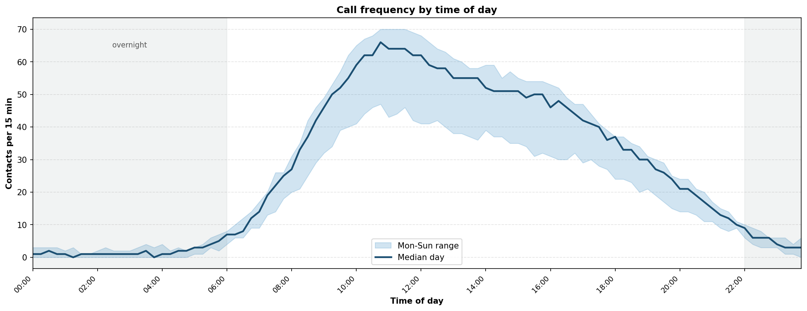

The same data folded to a single day. The band is the Monday-to-Sunday spread
at each interval; the line is the median. A forecast is a point estimate
through the middle of that band, which is why a schedule optimised against the
mean is fragile at the edges.

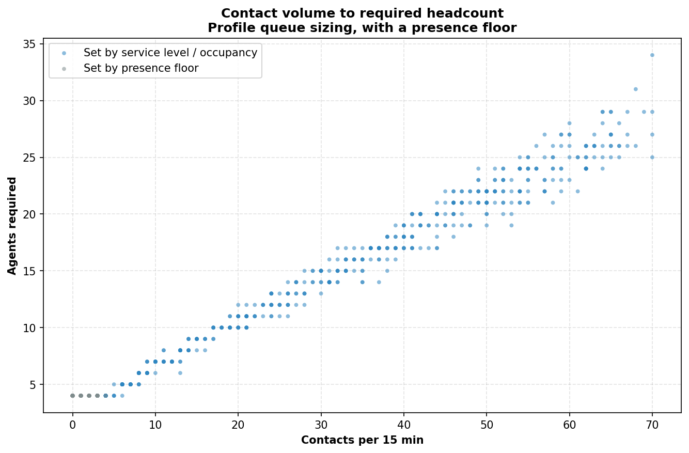

How volume converts to headcount. Not a straight line - queueing has economies
of scale, so the marginal agent covers more contacts as the queue grows. The
flat grey shelf at the bottom left is the presence floor, where staffing is set
by the operating model rather than by arithmetic.

### What the solver produced

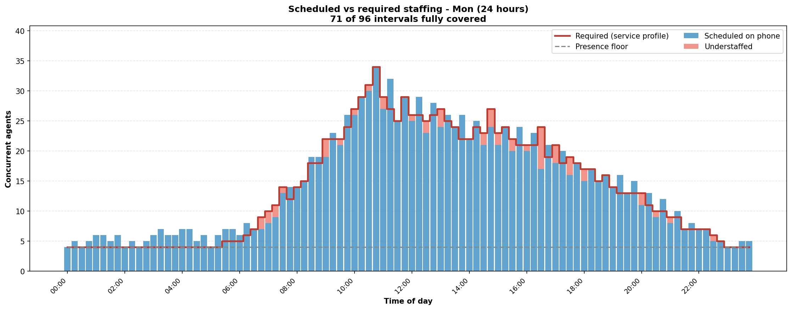

One full 24-hour day. Blue bars are agents on the phone, the red step is the
profile-sized requirement, the dashed grey line is the presence floor, and pink is
where the schedule falls short.

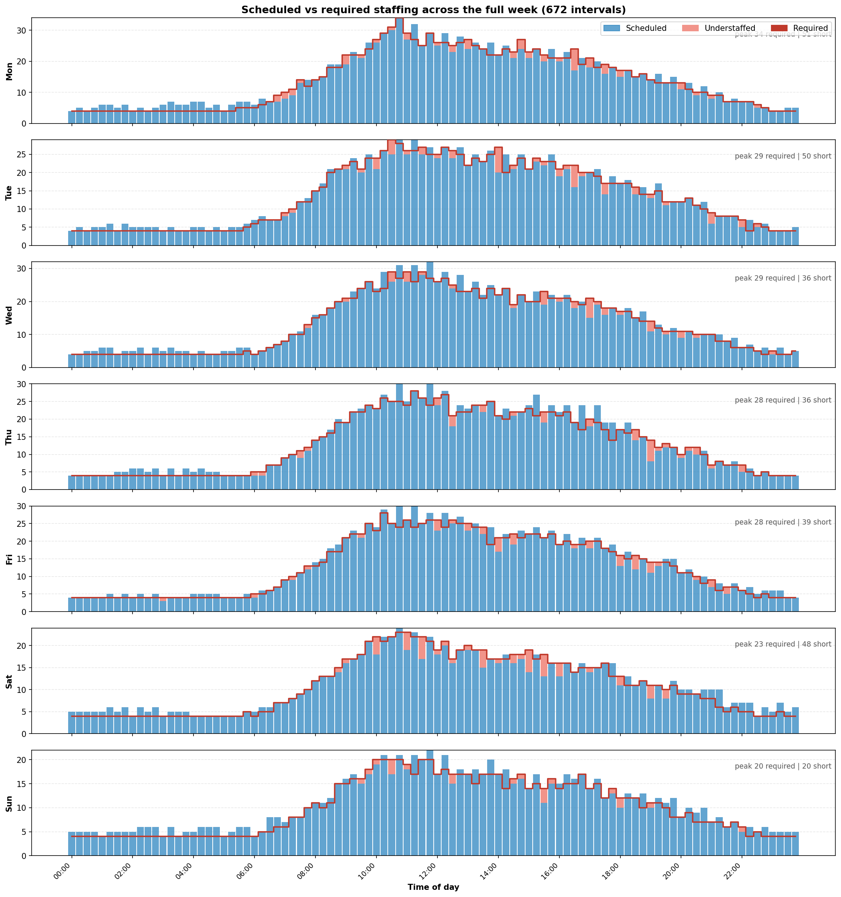

All seven days stacked, with peak requirement and shortfall annotated per day.

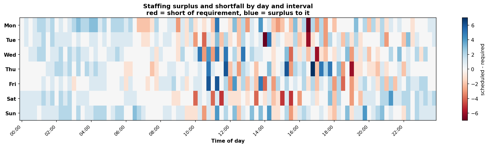

The same information as a grid. Red is short of requirement, blue is surplus,
white is exact. Reading down a column shows whether a time of day is
chronically hard to staff - something a per-day chart hides.

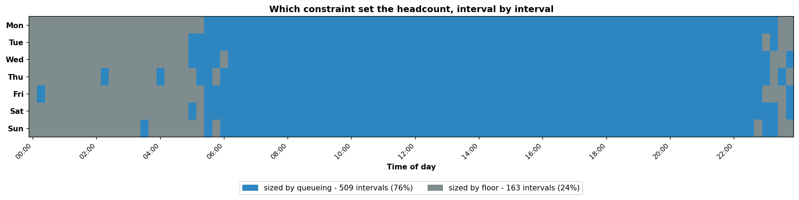

The chart worth dwelling on. Every interval is coloured by *why* it has the
headcount it does. **509 intervals (76%) are sized by the queueing
calculation; 163 (24%) are sized by the presence floor.** The grey overnight
block is the point: between roughly 23:00 and 06:00, staffing is not a
queueing decision at all. Erlang C would correctly answer "one agent, or none",
and the operating model overrides it. No amount of queueing theory produces
that number.

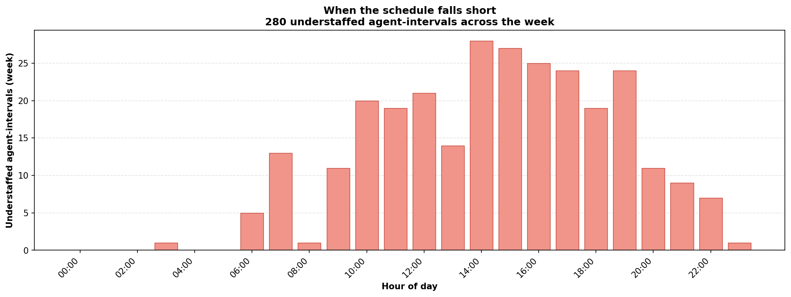

Understaffing summed by hour of day across the week, showing which parts of the
day the 8.5-hour block structure cannot cover cleanly.

### What the people are doing

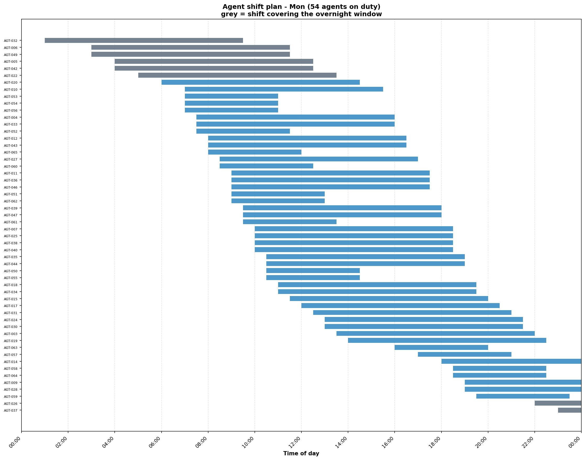

Each agent's shift for one Monday, sorted by start time - **54 of the 65
agents on duty**. The staggered starts the optimiser chose show up as a
diagonal; grey bars cover the overnight window. Breaks are not drawn: the
export records how many break intervals a shift has, not where they fall.

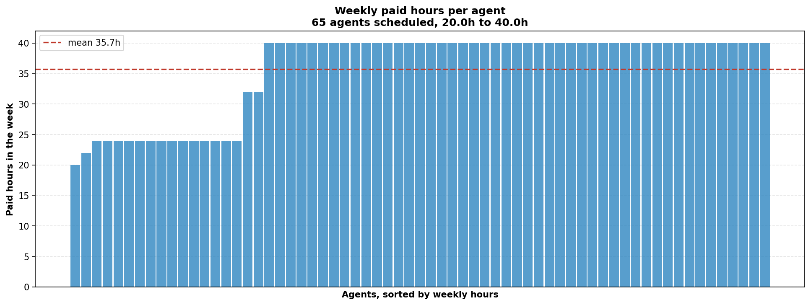

Paid hours per agent for the week, sorted. **Range 20.0h to 40.0h, with no
agent over the 40-hour ceiling** - the cap holds without the solver being told
to avoid overtime, because it is a hard constraint rather than a penalty.

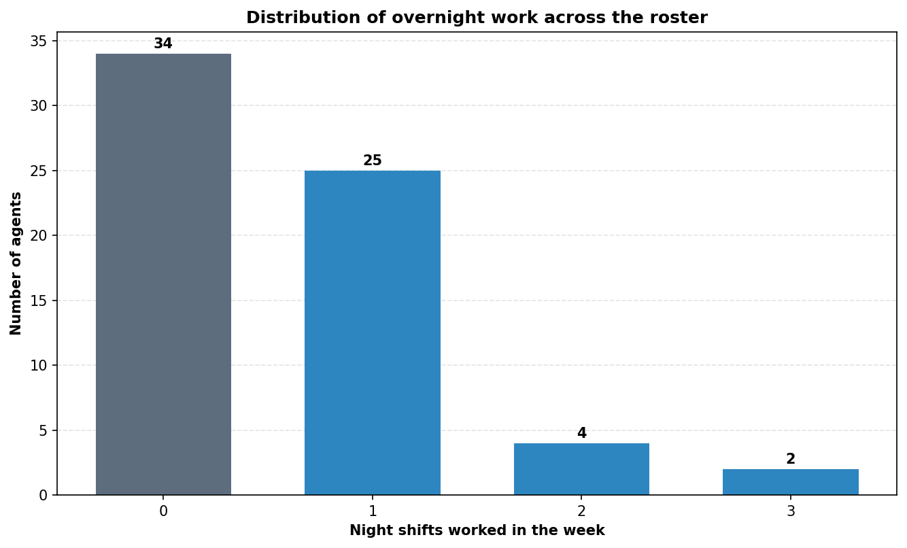

How night work is spread. **34 of 65 agents work no overnight shift at all**;
25 work one, 4 work two, 2 work three. Of those 34, sixteen are part-timers
with no night minimum and **18 are full-timers who fall short of theirs** -
the trade-off measured earlier. Raising `night_min_penalty` from 50 to 500
clears 15 of the 18 and removes the last floor breach, at the cost of 23 more
understaffed daytime intervals.

All three roster charts come from `artifacts/assignments_247.csv`, exported by
the same solve that produced every other figure here.

### Where the outputs live

`artifacts/` holds the 24/7 results - `cbc_baseline_247.json`,
`coverage_report_247.csv` and `assignments_247.csv`. Pattern results and readable
schedules are in `artifacts/patterns/` and `artifacts/schedules/`. `data/` holds the weekday pipeline's outputs (`schedule.csv`,
`coverage.csv`, `agent_hours.csv`, `synthetic_demand.csv`), written by
`run_pipeline.py`. They describe different models and are not comparable.

### What is not modelled

There is no call *taxonomy*. The demand stream is homogeneous - contacts and
average handle time, nothing else. No categories, intents or reason codes, and
no chart of them, because the model does not distinguish a billing query from
an outage report. Multi-channel concurrency, which would separate voice (1:1)
from digital (1:k), is out of scope - see `docs/SCOPE_AND_ROADMAP.md` -
which is a capacity concept rather than a call type.

Weather scaling adjusts arrival rates upstream and has no visualisation; its
effect appears only as a changed demand curve.

## Shift swaps: an instant, explainable answer

A weekly re-solve takes minutes. That makes it useless for approving a shift
trade, which is a decision a supervisor needs in the moment. `src/swap_validator.py`
answers it in microseconds with closed-form arithmetic and no solver.

The module rests on one observation: **interval coverage is invariant under a
one-for-one trade.** Both shift envelopes remain staffed; only the names
change. So no swap can breach a presence floor or move interval headcount, and
there is deliberately no check for it - a test asserts the invariant rather
than leaving it as a comment.

The swap endpoint checks these four per-agent rules:

| Check | Rejection |
| --- | --- |
| Contract partition | `Contract mismatch: cannot swap FT shift with PT shift.` |
| One shift per day | `Agent A assigned multiple shifts on day 2 (2 shifts).` |
| Weekly hour ceiling | `Agent A would exceed weekly cap: 42.0h > 40.0h.` |
| Turnaround rest | `Agent B violates turnaround rest between day 0 and day 1: 9.50h provided, 10.0h required.` |

Plus guards for a self-swap and for a shift the requesting agent does not hold.

Every rejection names the agent, the day and the quantity, so the answer is
what to change rather than only that it was refused.

```bash
POST /v1/shifts/validate-swap
{"is_valid": false,
 "reasons": ["Agent B violates turnaround rest between day 0 and day 1: 9.50h provided, 10.0h required."]}
```

## Three operating patterns, one engine

A contact centre is data, not code. The same solver runs all three
configurations below; nothing changes but `src/patterns.py`. Reproduce with
`python run_pattern.py <pattern>` and `python export_schedules.py`.

| Pattern | Days | Hours | Roster | Binaries | Gap | Coverage | Understaffed | Floor breaches |
| --- | --- | --- | ---: | ---: | ---: | ---: | ---: | ---: |
| `weekday_extended` | Mon-Fri | 07:00-19:00 | 65 | 4,385 | **0.0%** | 98.96% | 13 | 0 |
| `seven_day_extended` | Mon-Sun | 07:00-22:00 | 100 | 14,903 | **0.0%** | 100.0% | 0 | 0 |
| `continuous_247` | Mon-Sun | 24 hours | 150 | 13,090 | **0.0%** | 100.0% | 0 | 0 |

The stored runs report a 0.0% gap for the configured CBC shortfall objective. Published
schedules are in `artifacts/schedules/`: one row per assigned shift with agent,
day, start, end, paid hours and break count, plus an interval-by-interval
coverage file per pattern.

The continuous sample carries **8,138 surplus agent-intervals** and 5,190 paid
hours. Surplus and labour cost are not penalized in this formulation. The two
daytime patterns also carry a constant night-minimum penalty because their
eligible libraries contain no night starts. Grid/workbook paid hours are split
by calendar day; overnight carryover is included on the following day.

### What made the difference

Difficulty tracked **utilisation**, not model size. The same seven-day pattern
at an 85-agent roster (0.81 utilisation) had to be killed after 1,120 seconds;
at 100 agents (0.68) it proves optimality in 4 seconds with a *larger* model -
14,903 binaries against 12,677.

Two earlier results in this repository were artifacts of instances sized at the
edge of their own ceiling rather than properties of the method:

- A 52.8% optimality gap, from a 24/7 instance whose demand had been reduced to
  fit an undersized 65-agent roster. Sized honestly, the same formulation on the
  same solver closes to 0%.
- An apparent tractability wall at 150 agents, where a ~126,000-variable model
  exhausted memory during construction. A coarser shift-start grid - closer to
  how a continuous desk is actually run - brings it to 13,090 binaries and a
  68-second proven-optimal solve.
