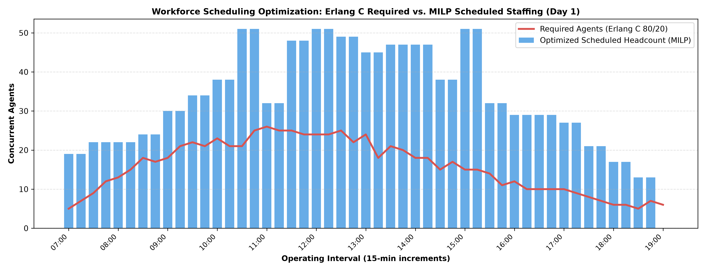
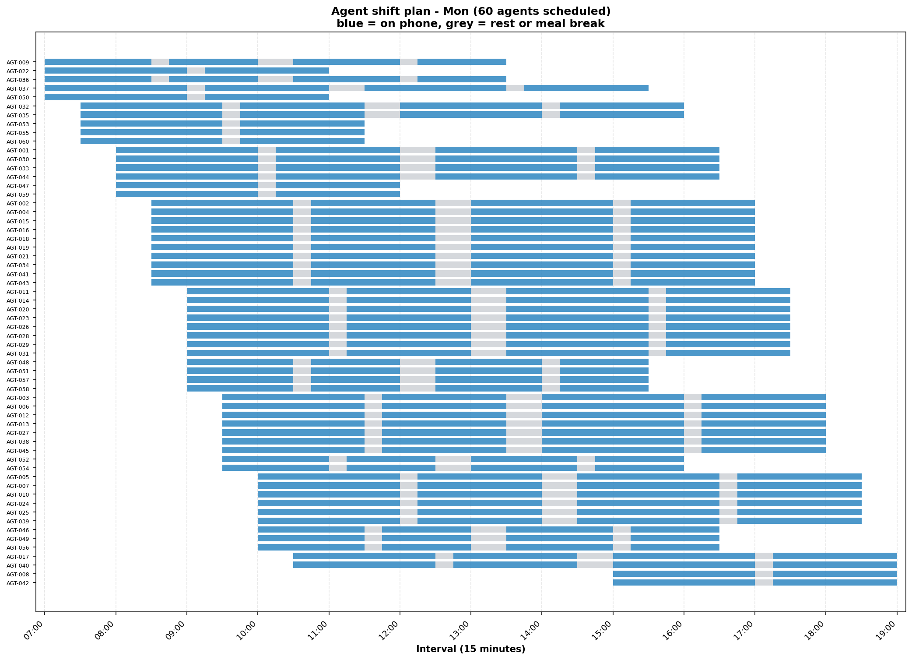

# wfm-schedule-optimizer

[](https://github.com/jibrankazi/wfm-schedule-optimizer/actions/workflows/ci-cd.yml)


A contact centre workforce scheduler and intraday operations service. Erlang C sizes each 15-minute interval, Erlang A quantifies finite-patience abandonment, and a mixed-integer program assigns 60 named agents to shifts across a five-day week under contracted hours, booked leave and start-time accommodations.

The operational layer adds a deterministic queue rebalancer, a tamper-evident SHA-256 audit chain, a FastAPI gateway, and a three-persona Streamlit console. The supplied data remains synthetic.



Red is what queueing theory says the interval needs. Blue is what the optimiser scheduled. Pink is where it fell short.

## Result

| | |
| --- | --- |
| Problem size | 60 agents, 5 days, 49 intervals/day, 37 shift templates, **8,850 binary variables** |
| Demand | 6,287 agent-intervals required across the week, peak 55 concurrent agents |
| Solve | **51 seconds**, CBC, stopped at a 3% relative gap |
| Coverage | **95.5%** of intervals fully staffed (234 of 245) |
| Shortfall | 50 agent-intervals, **12.5 hours** across a 1,572-hour week |
| Constraints | 0 breaches of contracted maximums, leave, or accommodations |

Of those 50 understaffed agent-intervals, **40 are inherent to the demand curve** and only 10 come from individual availability. That split is computed, not estimated — see below.

## The two problems

**Sizing** is a queueing question. Given calls arriving and how long each takes, how many agents must be on the phone to answer 80% within 20 seconds without running the floor past 85% occupancy? Erlang C answers it per interval.

**Assignment** is combinatorial. Which named people work which shifts, when everyone has their own contracted hours, booked leave and start-time constraints? That is the MILP.

## Sizing: Erlang C

Offered load in Erlangs is `calls × AHT / 900`. The textbook Erlang C formula is written with factorials:

```
P(wait) = [A^N/N! · N/(N−A)] / [Σ(A^k/k!, k<N) + A^N/N! · N/(N−A)]
```

Evaluated literally in floating point that raises `OverflowError` above roughly 135 Erlangs, because `A^N` overflows a float long before the ratio does. This uses the Erlang B recursion instead, which never forms that term:

```
B(0, A) = 1
B(n, A) = A·B(n−1, A) / (n + A·B(n−1, A))
C(N, A) = B / (1 − ρ(1 − B))          ρ = A/N
```

Identical to machine precision at loads where both work, O(N), no ceiling. A test asserts the equivalence and a second asserts the factorial form overflows where the recursion does not.

**Two criteria, and which one bites depends on scale.** At 25 Erlangs the 80/20 service level forces headcount up while occupancy sits at 83%, comfortably under the cap. At 53 Erlangs the queue enjoys economies of scale — it hits 80/20 while still running agents at 89% — and the occupancy cap becomes the binding constraint. Drop the cap and you get staffing that satisfies the SLA and burns the floor out.

## Assignment: the MILP

```
x[i,d,s] ∈ {0,1}    agent i works template s on day d
under[d,t] ≥ 0      agents short of the requirement
over[d,t]  ≥ 0      agents surplus to it
short[i]   ≥ 0      hours below agent i's contracted minimum

minimise   100·Σ under  +  1·Σ over  +  50·Σ short·4

s.t.  Σ_s x[i,d,s] ≤ 1                                    one shift per day
      Σ_d,s x[i,d,s]·hours[s] ≤ max_hours[i]              hard ceiling
      Σ_d,s x[i,d,s]·hours[s] + short[i] ≥ min_hours[i]   soft floor
      Σ_i,s x[i,d,s]·cover[s][t] + under − over = req[d,t]
```

Understaffing is the thing being avoided, so it is priced a hundred times a surplus agent. Breaching a contracted minimum sits between the two.

**Shifts come from templates, not free interval booleans.** Unconstrained per-interval variables produce mathematically optimal, operationally absurd rosters where an agent works 07:00–07:15 and again at 16:45. Each template carries a legal shape: contiguous hours, a 30-minute unpaid meal break, two paid 15-minute rests.

**Paid hours and coverage are different numbers.** Rest breaks are paid but off-phone; the meal is neither. An 8-hour template is 34 intervals on site, 32 paid, 30 on the phone. Conflating the two is the classic way to build a roster that looks compliant and still leaves the queue unmanned at 12:30.

**Availability is structural, not a constraint.** A variable only exists where the agent could legally work that template, so leave and accommodations shrink the model instead of adding rows to it.

**The weekly minimum is soft; the maximum is hard.** A hard minimum combined with leave and accommodations makes the model infeasible for reasons that have nothing to do with scheduling, and an infeasible solve tells you nothing. Priced at 50 it still dominates surplus staffing, so the solver only breaches a minimum when nothing else works — and then it reports who and by how much.

## Splitting the shortfall

The same coverage problem solved with agents treated as interchangeable — decide only *how many* of each template run each day, no identities, no leave — is a relaxation that solves in 0.6 seconds and bounds what any real schedule can achieve.

```
lower bound (agents interchangeable) : 40 agent-intervals short
solved schedule (named agents)       : 50 agent-intervals short
```

So 40 is a demand-curve problem needing different shift shapes or more establishment, and 10 is a roster problem that different leave approvals would move. Without the bound you cannot tell those apart, and you end up hiring to fix something a scheduling change would have solved.

## Quickstart

```bash
git clone https://github.com/jibrankazi/wfm-schedule-optimizer.git
cd wfm-schedule-optimizer
pip install -r requirements-dev.txt

python run_pipeline.py        # solve the week, write charts and CSVs
pytest -q                     # unit and integration tests
```

CBC ships inside PuLP, so there is no solver to install separately. The full solve takes about a minute; `--step 4` trades roughly nine points of coverage for a six-second solve.

```
--seed        int    reproducibility seed              (default 42)
--time-limit  int    solver time limit in seconds      (default 120)
--gap         float  relative MIP gap to stop at       (default 0.03)
--step        int    shift start granularity           (default 2 = 30 min)
```

**[notebooks/schedule_optimization.ipynb](notebooks/schedule_optimization.ipynb)** walks the whole thing with outputs already rendered, so it reads in the browser without cloning.

## API and portal

```bash
uvicorn api.main:app --host 0.0.0.0 --port 8000
streamlit run app.py
```

Open `http://localhost:8000/docs` for the REST contract and `http://localhost:8501` for the portal. The API exposes vector Erlang C sizing, Erlang A metrics, interval rebalancing, and audit-chain verification.

To run both services in containers:

```bash
docker compose up --build
```

Set `AUDIT_VAULT_PATH` to persist the audit JSONL file. The Compose configuration mounts it on a named volume.

## What each agent does

Aggregate coverage can look right while the per-agent plan is unworkable. The staggered starts the optimiser chose show up as a diagonal.



## How it fits together

```
run_pipeline.py
├── generator.py — seeded synthetic demand, roster and shift templates
│   ├── bimodal intraday curve, Monday heavy and Friday light
│   ├── 45 full-time and 15 part-time agents, ~10% with start-window accommodations
│   └── capacity_report() — does contracted labour cover demand at all?
├── erlang.py — interval sizing
│   └── Erlang B recursion, service level and occupancy criteria
├── optimizer.py — the MILP
│   ├── solve_schedule() — named agents, all constraints
│   └── coverage_lower_bound() — the relaxation, for splitting the shortfall
├── erlang_advanced.py — vector Erlang C and finite-patience Erlang A
├── smart_rebalancer.py — priority-based offline-duty pre-emption
├── audit_vault.py — append-only, SHA-256 chained audit records
├── api/main.py — FastAPI queueing, rebalancing and audit endpoints
├── app.py — Streamlit operations console
├── reporting.py — coverage chart, week view, agent Gantt
└── tests/ — queueing, audit, API, rebalancing and solver validation
```

Constraints are verified by re-deriving them from the returned assignments rather than trusting the solver: no double bookings, no contracted maximum breached, nobody scheduled during their own booked leave, no part-timer given a full-time shift, and the reported coverage array reconstructed from scratch.

## What this does not do

- **Shrinkage is explicit, not an uplift.** Breaks are carved out of the coverage vectors rather than added as a blanket percentage. Unplanned absence and adherence are not modelled, so real coverage would run below what is shown.
- **Demand is deterministic.** Each interval takes its expected volume. A real forecast carries error, and a schedule optimised against a point estimate is fragile to it.
- **Erlang C still drives scheduled headcount.** Erlang A reports finite-patience operational metrics; it is not yet wired into the MILP requirement curve.
- **Intervals are independent.** Erlang C is steady-state; calls queueing at 10:15 and still waiting at 10:30 are not carried across.
- **Optimality is not proven.** With 60 largely interchangeable agents the model is highly symmetric, so the search stops at a 3% gap. The relaxation bound is the honest measure of what is left on the table.
- **All data is synthetic and seeded.** No real call volumes, no real employees, no real contact centre.
- **The audit vault is tamper-evident, not immutable infrastructure.** A hash chain detects modified records but cannot prevent a privileged actor from deleting the tail or rewriting the file and all subsequent hashes. External hash anchoring, access controls, retention policy, and independent legal review are still required; this repository does not certify MFIPPA or PIPEDA compliance.

## License

MIT
